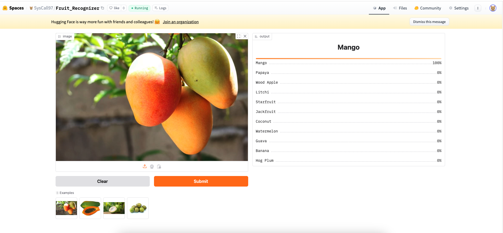

# Fruit-recognizer
## Objective

This is an image classifier project where I've focused on data collection, data cleaning, augmentation, model training, model deployment, API integration. The model can classify 11 differenct types of fruits, they are-
1. Mango
2. Jackfruit
3. Litchi
4. Guava
5. Coconut
6. Banana
7. Papaya
8. Starfruit
9. Watermelon
10. Wood Apple
11. Hog Plum

## Dataset Preparation
<b> Data Collection: </b> Downloaded form DuckDuckGo using term name  
<b>DataLoader: </b> Used fastai DataBlock API to set up the DataLoader.

## Model Training and Data Cleaning:
 <b>Model Training: </b>Fine-tuned a resnet50 model for 12 epochs and got upto ~83% accuracy.  
 <b>Data cleaning: </b> Manual data cleaning, since there are so many incorrect images that overlapped with different classes.

 ## Model Deployment:
 I deployed the model in HuggingFace spaces Gradio app. You can finc the implementation under `huggingface-deployment` folder of this repo or [here](https://huggingface.co/spaces/SysCall97/Fruit_Recognizer/tree/main) 

# API integration with GitHub Pages
The deployed model API is integrated [here](https://syscall97.github.io/fruit-recognizer/) in GitHub Pages Website. Implementation and other details can be found in `docs` folder.